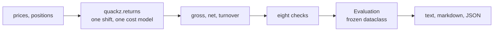

# QUACKZ

[](https://github.com/PNX89/QUACKZ/actions/workflows/ci.yml)


**If it quacks like an overfit.**

`quackz` audits a trading backtest for the ways backtests overstate themselves. Give it a
price series and a position series; it gives back a report with a PASS, WARN or FAIL on
each of eight checks, the arithmetic behind every verdict, and the cut-off that produced
it.

## Every backtest is biased

The useful question is never whether a backtest is optimistic, but which biases are in it
and how large each one is. A Sharpe of 3 on one year of daily bars is ordinary when it is
the best of two hundred configurations and extraordinary when it is the first thing anybody
tried, and the number by itself does not say which happened. Most of the machinery for
telling those apart was published a decade ago and sits in papers rather than in tooling.

> **Scope, in five lines.** QUACKZ reads one price series and one position series and grades
> the statistical claims they support. It surfaces evidence; it does not certify a strategy,
> and no verdict here is a statement about intent. It cannot see how the positions were
> built, so lookahead baked into your signal passes every check. It has no portfolio or
> capacity model, and survivorship and point-in-time universe construction are out of scope.

## What it prints

Score two hundred random signals on one year of driftless synthetic prices and keep the best.
That is the whole of `examples/overfit_demo.py`, and below is its real output.

```text
$ uv run python examples/overfit_demo.py
Search: 200 random signals on 252 bars of driftless synthetic prices, seed 7.
Trial Sharpes: best 3.06, median 0.03, worst -2.92, standard deviation 1.22.

BACKTEST AUDIT
==============================================================================
Verdict: FAIL. 2 FAIL, 0 WARN, 5 PASS.

Sample                    2023-01-03 to 2023-12-19, 251 return bars
Annualization             252.00 periods per year, supplied
Costs charged             2.00 bps per unit of turnover
Trials declared           200, dispersion V = 1.4916 per year (trial_sharpes)
Resampling                1,000 resamples, seed 0
Report version            0.1.0

PERFORMANCE, NET OF COSTS
------------------------------------------------------------------------------
  Sharpe, annualized                  2.97
  Sharpe, per bar                   0.1869
  Sharpe, gross of costs              3.06
  Annualized return                 69.94%
  Annualized volatility             18.46%
  Total return                      69.58%
  Maximum drawdown                  -7.55%
  Skewness                           0.274
  Kurtosis, non-excess               2.894
  Lag-1 autocorrelation            -0.0393
  t-statistic, naive                  2.96
  t-statistic, Newey-West             3.05

CHECKS
------------------------------------------------------------------------------
[FAIL] Deflated Sharpe
       Deflated Sharpe 0.339 against 200 declared trials; FAIL below 0.50,
       WARN below 0.95.
       - Observed Sharpe 2.97 annualized against a benchmark of 3.38, the best
         a search of this size expects from pure noise.
       - Trial Sharpe dispersion V = 1.4916 per year (0.005919 per bar),
         source trial_sharpes.
       - Probabilistic Sharpe against a zero benchmark: 0.999.
       - Bars needed for 95% confidence the true Sharpe beats zero: 76,
         against 251 observed.

[FAIL] Noise floor
       Observed Sharpe 2.97 is 0.88 times the 3.38 a search of 200 trials
       expects from pure noise; FAIL at or below 1.00, WARN below 1.50.
       - Floor per bar 0.2128, annualized 3.38, from 251 observations and V =
         1.4916 per year (trial_sharpes).
       - The floor is the expected maximum of the search, Bailey and Lopez de
         Prado (2014) equation 1, the same benchmark the deflated Sharpe is
         measured against.

... elided: 4 more performance rows, 5 more checks (cost sensitivity, profit
    concentration, resampling, subperiod stability, execution delay, all PASS),
    the deflation table shown below, the cost grid and the limits section.
```

The data behind that report is synthetic and seeded: `numpy` generates it inside the example,
so the run reproduces from a clean checkout, nothing touches the network, and no market data
licence is involved anywhere in this repository. Against your own CSV it is one command:

```bash
uv run quackz report prices.csv --date-col date --price-col close --pos-col position --costs-bps 5 --n-trials 200
```

## Quickstart

```bash
uv pip install "git+https://github.com/PNX89/QUACKZ"     # use it
git clone https://github.com/PNX89/QUACKZ && cd QUACKZ   # or work on it
uv sync --dev && uv run pytest
```

From Python, the whole API is one call and one renderer:

```python
import numpy as np
import pandas as pd
from quackz import evaluate
from quackz.report import headline, text_report

index = pd.date_range("2022-01-03", periods=500, freq="B")
rng = np.random.default_rng(0)
prices = pd.Series(100.0 * np.cumprod(1.0 + 0.01 * rng.standard_normal(500)), index=index)
positions = pd.Series(np.sign(rng.standard_normal(500)), index=index)

evaluation = evaluate(
    prices, positions, costs_bps=5.0, periods_per_year=252.0, n_trials=200, var_trial_sharpes=0.5
)
print(headline(evaluation))
print(evaluation.checks.cost_sweep.break_even_bps)
print(text_report(evaluation))
```

`positions[t]` is the exposure you decide at bar t's close, so it earns bar t+1's return.
That convention is the one thing to get right before reading any output: QUACKZ shifts the
position by one bar itself, and an already-shifted series is charged for the delay twice.

## The eight biases

| Bias | What it does to the number | Covered by |
| --- | --- | --- |
| Selection over repeated trials | Inflates the winner's Sharpe by the width of the search | Deflated Sharpe, noise floor, the DSR by trial count table |
| Sampling noise on a short record | Makes an ordinary run look like an edge | PSR, minimum track record length, stationary bootstrap, Newey-West t |
| Cost and slippage optimism | Prices a fill nobody can get | Cost sweep with a closed-form break-even, edge per unit of turnover |
| Event dependence | Turns a handful of bars into an annualized rate | Profit concentration |
| Regime dependence | Averages one good year over five flat ones | Subperiod stability, graded against sampling noise |
| Execution timing | Assumes a fill at a price the strategy could not have reached | Execution delay, verdict on the level at zero delay |
| Lookahead inside the signal | Uses information that did not exist yet | **Partly.** QUACKZ's own arithmetic is causal by construction, and reconciliation flags a claimed stream that the recomputed one does not match, but a position built from future information passes every check |
| Survivorship and point-in-time universe | Backtests a universe chosen with hindsight | **Not covered.** This is a property of the data, not of the arithmetic, and no function that receives only prices and positions can reach it |

## How it works



Every check consumes the same return streams, built once in `quackz.returns`, so no two lines
of the report can disagree about what the strategy earned, and every verdict sentence is
built once in `quackz.report`, so the three renderings cannot diverge.

## Check by check

### Deflated Sharpe

The probabilistic Sharpe ratio (Bailey and Lopez de Prado, 2012) is the probability that the
true Sharpe beats a benchmark, given the length of the record and its shape:

```text
PSR  = Phi[ (SR - SR*) * sqrt(T - 1) / sqrt(1 - skew*SR + ((kurt - 1) / 4) * SR**2) ]
SR_0 = sqrt(V[{SR_n}]) * ((1 - g) * Phi^-1[1 - 1/N] + g * Phi^-1[1 - (1/N) * e^-1])
```

The deflated Sharpe (Bailey and Lopez de Prado, 2014) is that probability measured against
`SR_0`, the best Sharpe that N trials of a strategy with no edge are expected to produce,
with `g` the Euler-Mascheroni constant and `V[{SR_n}]` the variance of the estimated Sharpes
across those trials. Kurtosis is non-excess throughout (a normal sample gives about 3), the
root is over `T - 1`, and every quantity is at the observation frequency. The three worked
examples in the 2014 paper are pinned as tests to four decimal places.

Supply `trial_sharpes`, the Sharpe of every configuration your search touched, or
`var_trial_sharpes`. With neither, QUACKZ falls back to the iid-normal `1/n_obs` and says so
in the report, because that fallback understates the deflation.

The command line takes the same two, so the honest number is not Python-only. `--trial-sharpes`
reads a file of annualized Sharpes, one per configuration, written by the search itself:

```bash
uv run quackz report prices.csv --n-trials 200 --trial-sharpes trials.txt
```

One number is less useful than the curve:

```text
DEFLATED SHARPE AGAINST THE NUMBER OF TRIALS
------------------------------------------------------------------------------
      Trials    Benchmark Sharpe       DSR
           1                0.00    0.9987
          10                1.92    0.8551
          50                2.78    0.5752
         100                3.09    0.4502
       200 *                3.38    0.3387
         500                3.73    0.2203
       1,000                3.98    0.1534
  * the declared trial count.
  The deflated Sharpe clears 0.95 up to 4 trials and falls below it at 5: from
  there on, a record this size is not distinguishable from the best of the
  search.
```

Read the last line first: five configurations are enough to explain that track record, and
the demo declared two hundred.

### Noise floor

The same expectation printed as a Sharpe rather than as a probability, so it can be held
against the observed number directly. The crude asymptotic `sqrt(2 ln N)` is not used
anywhere in this library: at N = 200 it overstates the true expected maximum by a factor of
1.1771, and a report that deflated with one estimator and drew its floor with another would
contradict itself in two adjacent paragraphs. A test asserts that ratio.

### Cost sensitivity

Mean net return and net Sharpe across a grid of costs, plus the break-even cost in closed
form:

```text
break_even_bps = 1e4 * mean(gross_return) / mean(turnover)
```

which follows from `net = gross - (bps / 1e4) * turnover`, so it is exact rather than read
off the grid. Mean net return is monotone non-increasing in cost by construction; the net
Sharpe is not, since costs move the mean and the dispersion together. Costs are charged on
`|pos[t-1] - pos[t-2]|`, including the trade into the first position and the trade out of
the last, so the cost path is a closed round trip from flat back to flat.

### Profit concentration

Sharpe recomputed with the best 1, 5 and 10 bars removed, and the share of gross profit
those bars carry. A record that survives losing its ten best bars describes a process; one
that collapses describes a few events. The same section reports the edge earned per unit of
turnover in basis points, which is the line to hold against a broker's quote.

### Resampling

A stationary bootstrap (Politis and Romano, 1994) across mean block lengths of 5, 20 and 60
bars. The p-value is null imposed: the returns are recentred to a mean of exactly zero, the
recentred series is resampled, and the figure reported is the fraction of resamples whose
Sharpe reaches the observed one. It is not the probability that the Sharpe is negative,
which is not a quantity a frequentist bootstrap produces. The interval is studentized
(Ledoit and Wolf, 2008) using a HAC standard error, because a percentile interval on a
Sharpe is badly calibrated under serial correlation.

A block bootstrap destroys dependence beyond the block length, so the drawdown percentiles
understate the tail, and every resample is built from bars this strategy actually traded.
The overfit demo scores 0.001 here and passes, which is the point: resampling the winner's
own returns cannot see the search that selected it.

### Subperiod stability

Sharpe over five contiguous windows of one fixed signal. Nothing is refitted between them,
so this measures temporal stability, not validation. The verdict is noise aware: a Sharpe
measured on n bars has a standard error of roughly `sqrt((1 + SR**2 / 2) / n)` (Lo, 2002),
so with five windows of two hundred bars the window Sharpes of a perfectly stable strategy
still scatter by around 1.1 annualized. What is graded is the observed dispersion divided by
the dispersion that sampling noise alone predicts.

### Execution delay

Sharpe with the position delivered 0 to 3 bars later than intended, all measured on the same
bars, alongside the mean holding period and the position autocorrelation.

The verdict fires on the level at zero delay, not on the decay. Fast decay is the normal
signature of genuine short-horizon alpha: a signal with a two-bar holding period has no
reason to survive a three-bar delay, so grading the decay would fail the honest case and
pass a slow-moving strategy that peeks. In the test suite a position set from the return it
is about to earn (Sharpe 20.5) clears the deflated Sharpe, the noise floor, the bootstrap,
the cost sweep, the concentration and the stability checks, and is caught here alone.

### Reconciliation

Correlation, tracking error and terminal wealth gap between the return stream your own
backtest claims and the one recomputed here from the same prices and positions. It runs only
when you pass `claimed_returns`. A gap is not evidence of lookahead and this check never says
that it is: almost every divergence is a convention, a different cost model, financing,
dividends, or a rebalance timed differently. The report lists the candidates and leaves the
conclusion to the reader.

### Splitters

`quackz.splits` carries two, both following the scikit-learn splitter protocol without
importing scikit-learn. `WalkForward` is forward only and is the honest default for trading
research. `EmbargoedKFold` is deliberately not called a purged K-fold: purging needs a label
end time for every observation, and a library given only prices and positions has none. It
applies a one-sided embargo of `embargo_pct * n_obs` bars after each test fold (Lopez de
Prado, 2018), and its docstring states the defect that remains, which is that every fold but
the last still trains on data postdating its test fold.

### References

- Bailey and Lopez de Prado (2012). The Sharpe Ratio Efficient Frontier. *Journal of Risk* 15(2).
- Bailey and Lopez de Prado (2014). The Deflated Sharpe Ratio: Correcting for Selection Bias, Backtest Overfitting and Non-Normality. *Journal of Portfolio Management* 40(5).
- Ledoit and Wolf (2008). Robust Performance Hypothesis Testing with the Sharpe Ratio. *Journal of Empirical Finance* 15(5).
- Lo (2002). The Statistics of Sharpe Ratios. *Financial Analysts Journal* 58(4).
- Lopez de Prado (2018). *Advances in Financial Machine Learning*. Wiley, chapter 7 for the embargo.
- Politis and Romano (1994). The Stationary Bootstrap. *Journal of the American Statistical Association* 89(428).

## Default thresholds

Every cut-off is a named constant in `quackz.checks` with its reasoning written beside it.
They are one code path, not two: the constants are gathered into a frozen `Thresholds` and
threaded through every check, so an overridden cut-off changes the verdict and the sentence
that reports it at the same time.

| Check | WARN at | FAIL at | Why this number |
| --- | --- | --- | --- |
| Deflated Sharpe | below 0.95 | below 0.50 | 0.95 is the confidence a track record is conventionally asked to clear; below 0.50 the search explains the result better than an edge does |
| Noise floor ratio | below 1.5 | at or below 1.0 | At the floor the result is exactly what the search alone produces; below 1.5 the gap is inside the estimation error of both numbers |
| Cost break-even | below 20 bps | below 5 bps | A round trip in liquid cash equities costs roughly 5 to 10 bps all in; clearing 20 bps leaves room for a worse fill than assumed |
| Bootstrap p-value | above 0.05 | above 0.10 | Conventional cut-offs, applied to the least favourable block length so a lucky block cannot rescue the verdict |
| Subperiod dispersion ratio | at or above 1.5 | at or above 2.5 | Under a stable signal the ratio is distributed around 1; with five windows it clears 1.5 about one time in sixteen |
| Profit concentration | above 30% | above 50% | For a normal sample of a thousand bars the top ten carry about 7%, so 30% is several times the noise baseline |
| Execution delay level | at or above 5 | at or above 10 | An annualized Sharpe this high sits outside documented liquid-market results at any meaningful capacity |
| Reconciliation correlation | below 0.999 | below 0.99 | Two implementations of one rule that differ only in conventions still track each other above 0.999 |
| Reconciliation wealth gap | above 1% | above 10% | Ten cents on the euro of terminal wealth is not a convention difference |

```python
evaluate(prices, positions, thresholds={"dsr_warn": 0.99, "cost_break_even_bps_fail": 10.0})
```

A swapped pair is rejected at construction, because a reversed ladder silently returns PASS
for everything.

## Design decisions

**numpy and pandas at runtime, nothing else.** The statistics here are a few hundred lines
of arithmetic. Every dependency added to a library like this one is a version conflict in
somebody else's research environment later, and none of these formulas needs one.

**The normal distribution comes from the standard library.** `statistics.NormalDist` gives
both the cdf and the inverse cdf (Wichura AS241, accurate to about 1e-16), so scipy stays a
development dependency. It is there to check that agreement: tests pin `NormalDist` against
`scipy.stats.norm`, and the method-of-moments estimators against `scipy.stats.skew` and
`scipy.stats.kurtosis`, to 1e-12.

**One explicit position convention, stated everywhere.** No frequency strings mapped to
constants behind your back, no silent inner joins, no `fillna(0)` that swallows the cost of
the first trade. Misaligned inputs are an error with the fix in the message. The
annualization factor is inferred from the index itself and printed in the report, so a
reader always knows what the number was scaled by.

**One extreme-value estimator, used twice.** The DSR benchmark and the noise floor come from
the same Bailey equation. Shipping `sqrt(2 ln N)` alongside it would have been easier and
would have put two disagreeing numbers in one report.

**No plotting, no dashboard, no letter grade.** The output is text, markdown and JSON, all
built from one set of sentences. A letter grade would invite a reader to skip the checks,
and the checks are the report.

**Failure is a first-class output.** The CLI exits 0 on pass or warn, 1 on a failing verdict
and 2 when it could not run at all, so `quackz report` belongs in a CI job beside the tests.

## Why I built this

I automate things people currently do by hand, and then I have to defend the numbers those
systems produce. The pattern is the same in every domain: the first version of a measurement
flatters whoever built it, and the useful work is the second pass that asks what else would
produce the same number. In trading research that second pass is well specified in the
literature and rarely in the tooling, so I wrote the tool I wanted to have had, and made it
print its own limits beside its own verdicts.

## Limitations

- **One strategy, one instrument.** No portfolio construction, no correlation between
  strategies, no capacity or impact model. A PASS says nothing about a book of twenty.
- **The trial count is a declaration.** The deflated Sharpe is exactly as honest as the
  `n_trials` you supply, and QUACKZ cannot see the configurations you tried and did not
  report, including the ones you tried before you started counting.
- **Lookahead inside the signal is invisible.** The one-bar shift shows only that this
  library's own arithmetic is causal. A position built from information that did not exist at
  the decision time passes every check here.
- **Block bootstrap understates drawdown tails.** Dependence beyond the block length is
  destroyed by the resampling, and the worst drawdowns in real markets come from runs longer
  than any block. Read those percentiles as a floor on the tail, not a description.
- **Resampling is not path robustness.** Every resample is built from bars this strategy
  actually traded, so it probes the sampling noise in the realised profit and loss and says
  nothing about a different price path.
- **Survivorship and point-in-time universe construction are out of scope.** They are
  properties of the data. If your universe was chosen with hindsight, every number in the
  report describes a sample that never existed.
- **The thresholds are judgement calls.** They are documented and adjustable, and they are
  not laws. A PASS is the absence of evidence in these eight directions, not a certificate.
- **The examples are synthetic.** They exist to make the checks reproducible offline, not to
  demonstrate anything about a real market.

## Development

```bash
uv sync --dev
uv run pytest -q
uv run ruff check . && uv run ruff format --check .
uv run python examples/overfit_demo.py     # the report above
uv run python examples/momentum_demo.py    # an honest strategy, everything passes
```

The suite is deterministic, offline and runs in a few seconds. CI runs lint, format and the
suite on Python 3.11, 3.12, 3.13 and 3.14, all required legs.

## License

MIT. Copyright (c) 2026 Quelin Zammit.
